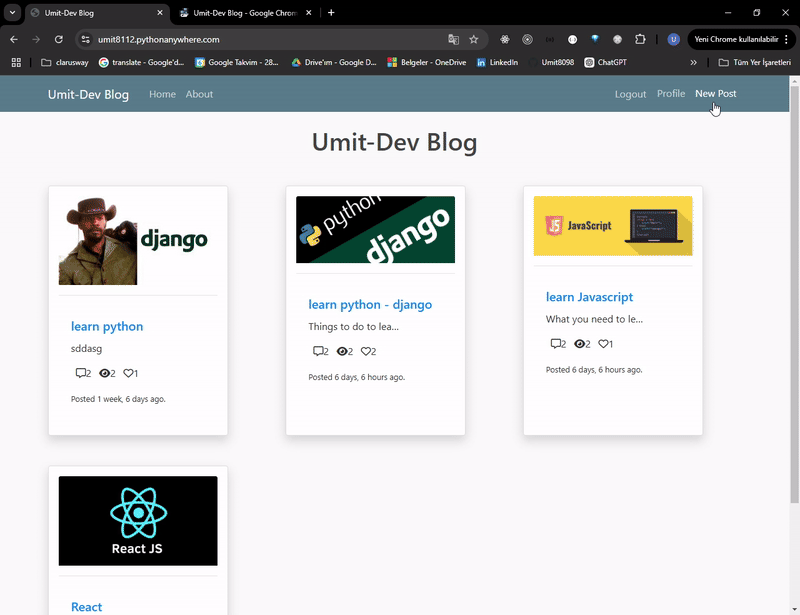

<p align="center">
  
  
  
  
</p>

<h1 align="center">📝 Django Dynamic Blog Platform</h1>

<p align="center"><strong>A professional, production-ready full-stack MVC blog platform built with Django 5.1 and Bootstrap 4, featuring automated slug generation, robust user interactions, and a complete SMTP-driven password recovery lifecycle 🚀</strong></p>

<div align="center">
  <h3>
    <a href="https://umit8112.pythonanywhere.com/">
      🖥️ Live Demo
    </a>
     | 
    <a href="https://github.com/umitarat-dev/django-google-allauth-integration.git">
      📂 Repository
    </a>
  </h3>
</div>

<p align="center">
  <a href="https://umit8112.pythonanywhere.com/">
    
  </a>
</p>

## 📚 Navigation
- [🚀 Live Application](#-live-application)
- [📦 Key Features](#-key-features)
- [🛠️ Built With](#️-built-with)
- [⚙️ Setup & Installation](#️-setup--installation)
- [📬 Contact Information](#-contact-information)


## 🚀 Live Application
The web application is fully optimized and deployed in a production environment. You can explore the platform anonymously or test the full interactive workflow by signing up.
* **Production URL:** [https://umit8112.pythonanywhere.com/](https://umit8112.pythonanywhere.com/)

## 📦 Key Features
* **Full CRUD Operations:** Authenticated authors can seamlessly create, read, update, and safely delete their own posts while maintaining unauthorized access blocks on a view-level.
* **Advanced User Analytics Engine:** Implements precise background metrics tracking for individual posts, calculating absolute **View Counts**, **Like Counts**, and **Comment Volatility** dynamically.
* **SMTP-Powered Password Recovery:** Includes a secure, complete multi-step lifecycle for password reset and modification, routing transactional authentication tokens safely through Gmail SMTP relays.
* **Automated SEO Optimization (Django Signals):** Leverages `pre_save` signals to handle automated, conflict-free, unique URL generation combining the post title with isolated UUID code fragments.
* **Clean Data Architecture:** Features automated cascades and protective constraints (`on_delete=models.PROTECT` on Categories) ensuring relational database integrity, alongside post-delete signals that wipe dead media folders upon user termination.
* **Secure Environment Isolation:** Decouples structural platform variables (`SECRET_KEY`, e-mail credentials) from version control tracking via `python-decouple`.

## 🛠️ Built With
* **Core Framework:** [Django 5.1.3](https://www.djangoproject.com/) (Python 3.11 MVT Architecture)
* **Form Layout Engine:** [django-crispy-forms](https://django-crispy-forms.readthedocs.io/) & [crispy-bootstrap4](https://github.com/django-crispy-forms/crispy-bootstrap4)
* **Image Processing:** [Pillow 11.0](https://python-pillow.org/)
* **Frontend Components:** Bootstrap 4.5.3, FontAwesome Icons, and Custom CSS3
* **Environment Controller:** Python-Decouple


## ⚙️ Setup & Installation

### Local Development Setup

#### 1. Clone the Repository & Environment Preparation
```bash
git clone [https://github.com/umitarat-dev/django-dynamic-blog-platform.git](https://github.com/umitarat-dev/django-dynamic-blog-platform.git)
cd django-dynamic-blog-platform

# Instantiate the virtual environment using Python 3.11
python3.11 -m venv env311
source env311/bin/activate  # Windows: env311\Scripts\activate
```

#### 2. Install Dependencies

```bash
pip install --upgrade pip
pip install -r requirements.txt
```

#### 3. Environment Configuration
Create a .env file directly in the root directory alongside manage.py:
```bash
SECRET_KEY=your_secure_local_django_secret_key
DEBUG=True
ALLOWED_HOSTS=127.0.0.1,localhost

# Transactional Email Engine
EMAIL_HOST=smtp.gmail.com
EMAIL_PORT=587
EMAIL_HOST_USER=your_email_address
EMAIL_HOST_PASSWORD=your_16_digit_gmail_app_password
EMAIL_USE_TLS=True
```

## 📬 Contact Information

I am actively open to corporate discussions regarding production backend architecture, software lifecycle deployments, and full-stack engineering vacancies.

* **LinkedIn:** [linkedin.com/in/umit-arat](https://www.linkedin.com/in/umit-arat/)
* **Email:** [umitarat8098@gmail.com](mailto:umitarat8098@gmail.com)
* **GitHub:** [github.com/umitarat-dev](https://github.com/umitarat-dev) (Current Workspace)